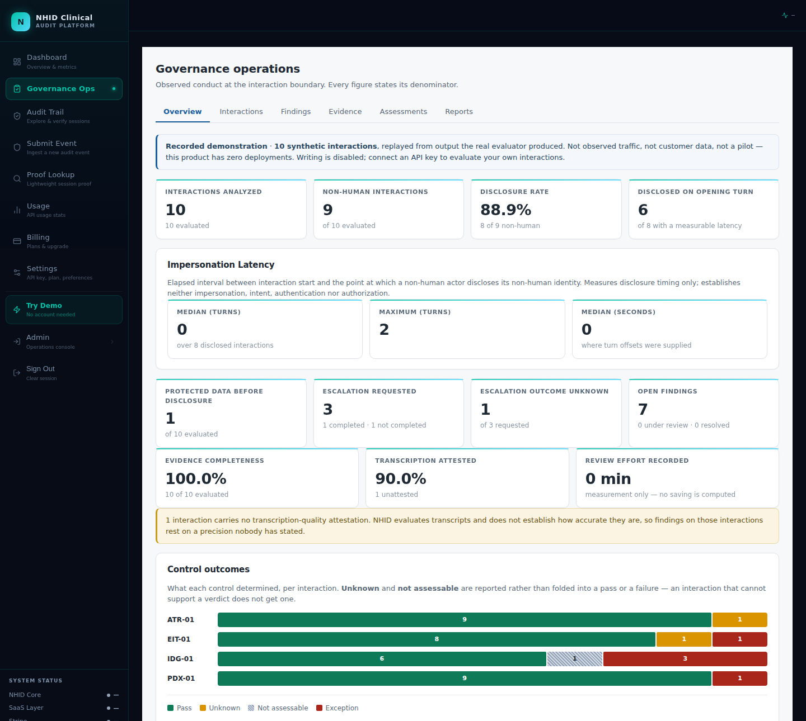
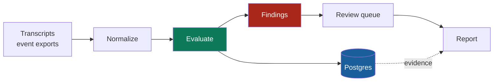
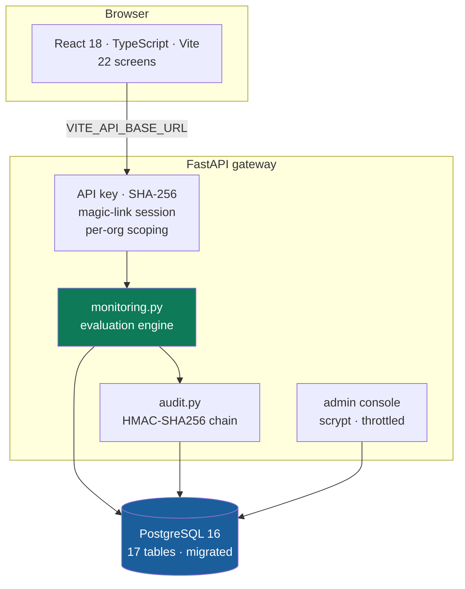

<div align="center">

# NHID-Clinical SaaS

**Governance monitoring and audit evidence for healthcare voice-AI interactions.**

Ingest the calls you already receive. Evaluate them against five deterministic controls.
Keep the evidence for what happened.

[](https://github.com/NHID-Clinical/NHID-Clinical-SaaS/actions)


[Framework](https://github.com/NHID-Clinical/NHID-Clinical) ·
[Deployment guide](docs/DEPLOYMENT.md) ·
[Product notes](docs/MONITORING_PRODUCT.md)

</div>



<div align="center"><sub>Governance Ops overview, running the recorded demonstration set. Every figure carries its denominator.</sub></div>

---

> [!IMPORTANT]
> **Zero deployments. Zero pilots. Zero validated willingness-to-pay.**
> The buyer, the workflow and the pricing are hypotheses. Nothing in this
> repository or its UI may be shown to anyone as evidence of demand. The
> engineering is real and tested; the business is not yet a business.

## What it does



Nothing in production changes. No provider issues a credential, no vendor integrates.
You upload what you already have.

| Stage | Where |
|---|---|
| **Ingest** | `POST /saas/monitor/ingest` — bounded to 500 interactions / 10 MiB |
| **Normalize** | `saas_layer/normalization.py` — one canonical shape from `generic`, `twilio`, `vapi` |
| **Evaluate** | `saas_layer/monitoring.py` — the real engine, deterministic |
| **Investigate** | Transcript, per-control result, and the reason for each |
| **Review** | `open → under review → resolved`, signed by the person who decided |
| **Report** | `GET /saas/monitor/assessments/{id}/report` |

## Four result states — and why two of them matter

| State | Meaning |
|:--|:--|
| 🟢 `pass` | The control was satisfied |
| 🔴 `exception` | The control was violated |
| 🟡 `unknown` | Evidence ran out before a verdict could be reached |
| ⬜ `not_assessable` | The interaction cannot support this control at all |

Most governance dashboards have two states and quietly round the hard cases into
one of them. If a caller asks for a human and the recording ends, completion was
neither observed nor refused — reporting that as a pass is fiction, and reporting
it as a failure is slander. It gets `unknown`.

## Architecture



## Two credentials, because a pipeline is not a person

| | credential | used by |
|---|---|---|
| **machine** | organization API key, SHA-256 at rest | ingest pipelines, scripts, CI |
| **human** | magic-link session, httpOnly cookie | people opening `/ops` in a browser |

The key is what a vendor's exporter authenticates with. The session exists for a
narrower reason: **so a review decision carries a name.** `review_events.reviewer`
used to be free text the client supplied, defaulting to the literal string
`"unknown"` — so a product built to answer *who did this, under whose authority*
could not answer it about its own users. It now records the authenticated user,
ignores any reviewer the request body claims, and marks an API-key action as
an unattributed machine action rather than as a nameless person.

No passwords: a link to a verified mailbox proves the same thing without a
stored secret, a reset flow, or a reuse liability inherited from every other
site the person has an account on.

**Multi-tenant by construction.** Every org-scoped query takes its `org_id` from the
authenticated key, never from the request body. `tests/test_workspace_isolation.py`
proves it empirically — it creates two organizations, gives one real evaluated data,
and tries to reach it with the other's key on every route that accepts an identifier.

## Run it locally

<details>
<summary><b>Three processes: Postgres, the API, the frontend</b></summary>

```bash
# 1 — schema
export DATABASE_URL="postgresql://localhost:5432/nhid_saas"
export HMAC_SECRET="dev-only-not-a-real-secret"
export ADMIN_PASS="dev-only-admin-password"
cd nhid-clinical && python scripts/migrate.py

# 2 — API on :8010
uvicorn saas_main:app --host 127.0.0.1 --port 8010

# 3 — frontend on :3000, proxying /saas-api → :8010
cd artifacts/nhid-saas && PORT=3000 BASE_PATH=/ npm run dev
```

Then open `http://localhost:3000/ops`. With no API key connected it replays the
recorded demonstration set; connect one to evaluate your own interactions.

```bash
python -m pytest tests/ -q      # 403 passed, 18 skipped
python scripts/migrate.py --status
```
</details>

<details>
<summary><b>Deploy it</b> — Render + Supabase</summary>

`render.yaml` describes both services. The full procedure — Supabase pooler URI,
migrations as a release step, the initial administrator, CORS, Stripe webhooks,
a ten-step smoke test — is in [`docs/DEPLOYMENT.md`](docs/DEPLOYMENT.md).

Nothing is deployed today. That document is the procedure, not a record.
</details>

## What's actually verified

| | |
|---|---|
| **403 passed, 18 skipped** | on a live Postgres, and again on a database built only by `scripts/migrate.py` |
| **Workspace isolation** | 15 tests; found and fixed a real cross-org write bug |
| **Admin surface** | 31 tests; every route refuses an unauthenticated and a fabricated token |
| **Sign-in** | 30 tests; single-use links, no email enumeration, and a name on every review |
| **Migrations** | applied to an empty database in CI, asserted to actually apply |
| **Recorded demo** | regenerated from the real engine; CI fails if the two disagree |

## Limits — stated, not buried

- **It reads transcripts and events.** A disclosure that was spoken but never
  transcribed is invisible to it. It does not establish transcription accuracy;
  where an attestation is missing, it says so rather than assuming.
- **`DBC-01` is not in this product.** It belongs to the older real-time
  voice-webhook path, not `monitoring.py`.
- **Not HIPAA compliant.** Using auth, TLS and a managed database does not make a
  deployment compliant — that is a property of an organization and its agreements,
  not of software. Synthetic and test data only until a deployment has been
  separately validated.
- **No passwords, no SSO.** People sign in with a link to their mailbox; there
  is no self-service sign-up, and roles stop at `owner` / `member`. SAML, SCIM
  and per-user API keys are not here.

## Licence

Apache-2.0 (code) · CC BY 4.0 (specification and docs) · Built by
[Brianna Baynard](https://github.com/thankcheeses)
