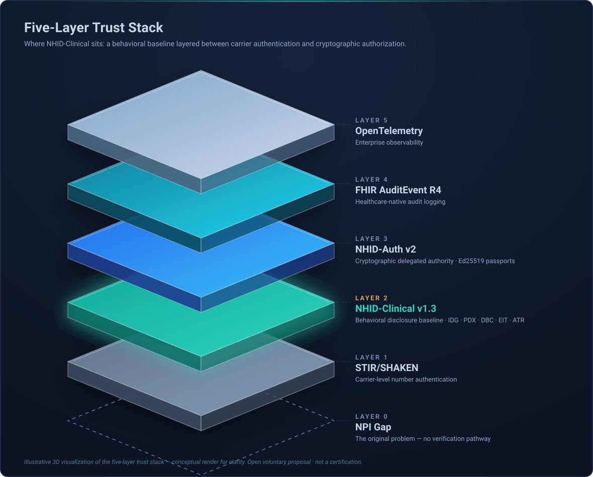

# NHID-Clinical

**A voluntary behavioral baseline + cryptographic authorization layer for transparent AI voice agents in B2B healthcare payer–provider calls.**

Not a standard. Not a certification. Not a product. An open, testable reference.

Built from real payer operations experience enforcing HIPAA on live calls. The core problem: AI agents were authenticating and pulling member data **before** disclosing they were non-human. That window is **Impersonation Latency**.

NHID-Clinical v1.3 gives you five concrete, testable controls and a per-call Call Authorization Score (CAS). NHID-Auth v2 adds Ed25519 agent passports, NPI binding, scoped delegation, and revocation.

**Strongest next step for most organizations:** Run a focused Tier 0 shadow pilot on your own traffic. The [Tier 0 Shadow Pilot Kit](docs/pilot-kit/README.md) makes this a 2–4 week exercise.

## The Four Core Controls (v1.3)

| Control | Requirement |
|---------|-------------|
| **IDG-01** | Disclose non-human identity before any PHI exchange |
| **PDX-01** | No protected data until identity is confirmed |
| **DBC-01** | No deceptive human mimicry (breathing, typing, hesitation cues) |
| **EIT-01** | Clear, honored human escalation path on request |

Plus **ATR-01** (Audit Trail) — every session produces a machine-readable, tamper-evident trace.

18-case Conformance Test Suite. **330+ Python tests passing.**

[Try the Governance Simulator →](https://nhid-clinical.org/simulator.html)

## Five-Layer Trust Stack

| Layer | Component | Role |
|-------|-----------|------|
| 0 | NPI Gap | The original problem |
| 1 | STIR/SHAKEN | Carrier number authentication |
| **2** | **NHID-Clinical v1.3** | Behavioral disclosure baseline |
| 3 | NHID-Auth v2 | Cryptographic delegated authority |
| 4 | FHIR AuditEvent R4 | Healthcare-native audit logging |
| 5 | OpenTelemetry | Enterprise observability |



*Illustrative 3D visualization of the five-layer trust stack — conceptual render for clarity. Open voluntary proposal · not a product, not a certification.*

## Quick Start

```bash
git clone https://github.com/nhid-clinical/nhid-clinical.git
cd nhid-clinical
pip install -r requirements.txt
python -m pytest tests/ -v
```

Expected: **330+ passing.**

## Live API (no key required for demo routes)

```bash
curl -s -X POST https://gfvq4swdtf.execute-api.us-east-1.amazonaws.com/prod/v1/adapters/vapi/check \
  -H "Content-Type: application/json" \
  -d @tests/demo_scenarios/vapi_noncompliant.json | python -m json.tool
```

Full endpoint list and integration guides on [nhid-clinical.org](https://nhid-clinical.org/).

## Repo structure

```
schema/     Canonical event schema (JSON Schema Draft 2020-12)
src/        Policy engine + cryptographic identity layer (pure Python)
tests/      Conformance suite (YAML) + failure harness (pytest) + trace generator
adapters/   Vendor format adapters (Twilio, Vapi, Retell, Amazon Connect → NHID trace)
traces/     Pre-generated failure traces
assets/     Brand system, control icons, and 3D/glass diagram set (SVG + PNG)
```

## Contributing & Pilot Partners

We're looking for the first shadow evaluation partners (observe-only, 90 days). Start with the Tier 0 kit — it produces usable impersonation latency + CAS data from your existing logs in 2–4 weeks.

[For Payers](https://nhid-clinical.org/for-payers.html) · [Community](https://nhid-clinical.org/community.html) · [GitHub Discussions](https://github.com/nhid-clinical/nhid-clinical/discussions)

---

**CC BY 4.0** · Brianna Baynard · NIST-2025-0035-0026 · [nhid-clinical.org](https://nhid-clinical.org/)
